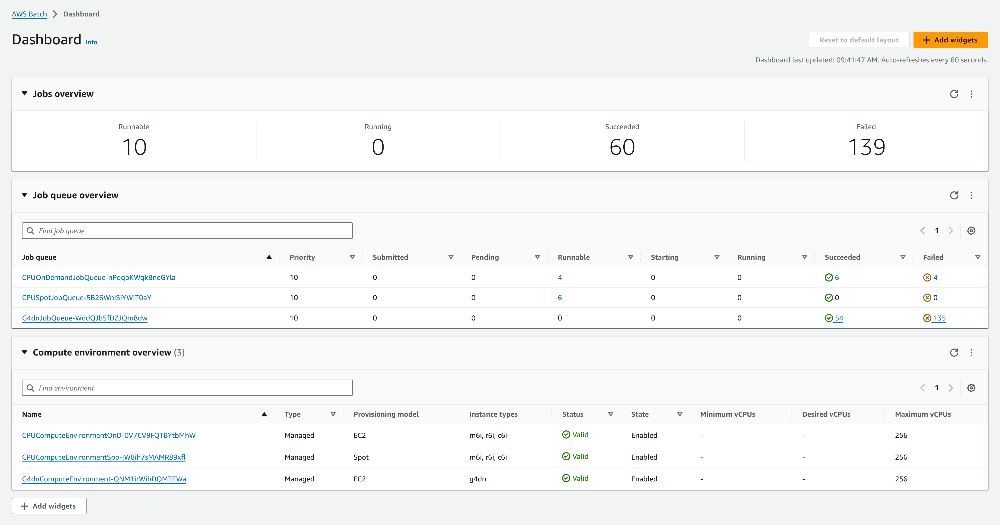
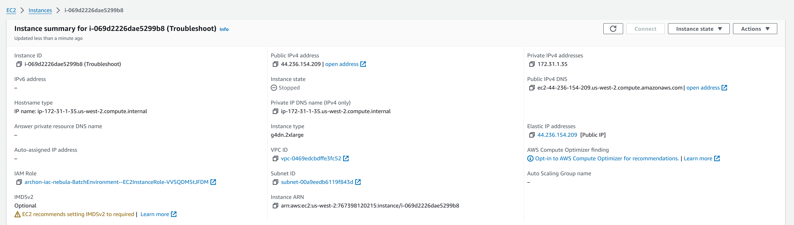
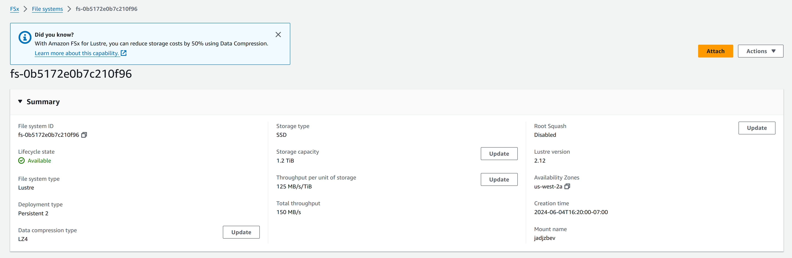
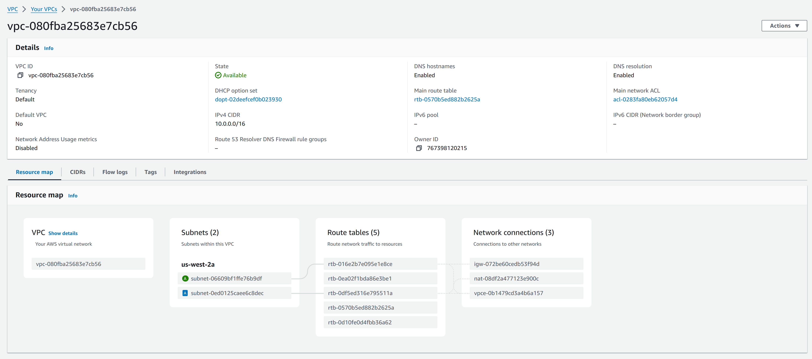
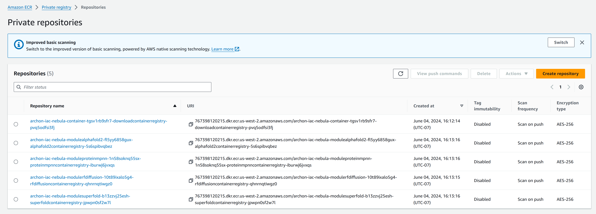
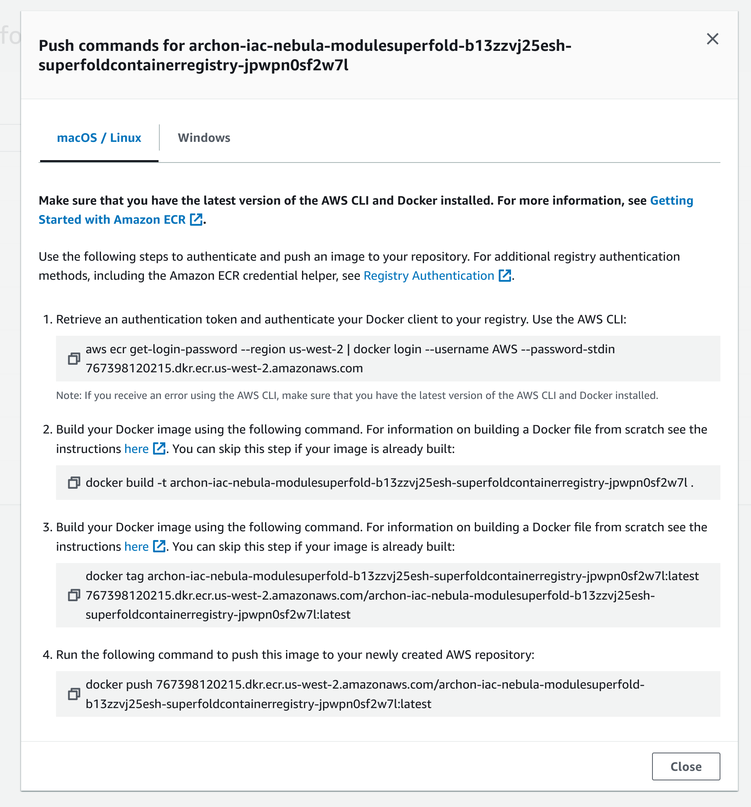

## Documentation for Archon Protein Modeling Infrastructure (AWS)

### **Todo**

[x] Cloud formation templates and documented deployment strategy
[x] Configure infrastructure prototype on AWS
[x] Docker containers built on suitable EC2
[x] Initial testing and validation

[ ] Deploy G5 and P4d environments (if desired)
[ ] G4dnSpotQueue

[ ] Documentation and operational handoff to Archon's team
   [ ] Train Archon on infrastructure
   [ ] Check code in to Archon Github
   [ ] Transfer Archon.pem to team


### **Infrastructure Setup**

AWS Batch Architecture for Protein Folding and Design

Infrastructure forked from https://github.com/aws-solutions-library-samples/aws-batch-arch-for-protein-folding

AWS Batch for protein folding uses CloudFormation to create scalable infrastructure, run containerized jobs, and handle GPU/CPU resources efficiently, integrating tools like AlphaFold, RFDiffusion, and Superfold for protein analysis.

#### AWS Batch Configuration
- **Compute Environments**
  - Setup managed compute environments tailored for protein modeling tasks.
  - Configure instance types and scaling policies for optimal performance.
  - Use instance types like P4 and G4dn families for GPU-intensive tasks.
  - G4dnComputeEnvironment: On-demand GPU compute environment using g4dn instance types.
  - [Optional] G5ComputeEnvironment: On-demand GPU compute environment using g5 instance types.
  - [Optional] P4dComputeEnvironment: On-demand GPU compute environment using p4d instance types.


- **Job Queues**
  - Create multiple job queues to manage priorities and segregate different types of computational tasks (e.g., backbone generation and protein folding).
  - CPUOnDemandJobQueue: Job queue for on-demand CPU instances.
  - CPUSpotJobQueue: Job queue for spot CPU instances.
  - G4dnJobQueue: Job queue for on-demand GPU instances. Single GPU instances.
  - [Optional] G5JobQueue: Job queue for on-demand G5 GPU instances.
  - [Optional] P4dJobQueue: Job queue for on-demand P4d GPU instances.

- **Job Definitions**
  - Define job specifications, including Docker images, vCPUs, memory requirements, and command overrides for different protein modeling tasks.
  - LaunchTemplate: Reference to the instance launch template.
  - CPUOnDemandJobQueue: Reference to the CPU on-demand job queue.
  - CPUSpotJobQueue: Reference to the CPU spot job queue.
  - G4dnJobQueue: Reference to the GPU on-demand job queue.
  - [Optional] G5JobQueue: Reference to the GPU G5 job queue.
  - [Optional] P4dJobQueue: Reference to the GPU P4d job queue.
  - DownloadJobDefinition: Reference to the download job definition.
  


#### EC2 Instances and AMIs
- **Instance Selection**
  - Select G4dn instances for low-resource jobs (single GPU, 16GB VRAM).
  - For resource intense jobs select P4d or G5 job queues.
  - Configure and use GPU-optimized AMIs that include necessary drivers and frameworks (e.g., CUDA, cuDNN) for running protein modeling applications.

   AMI ID and Source:

   AMI ID: ami-027492973b111510a
   Source AMI name: amzn2-ami-minimal-hvm-2.0.20240521.0-x86_64-ebs
   GPU Specifications and Versions:

   AMI name: amzn2-ami-ecs-kernel-5.10-gpu-hvm-2.0.20240528-x86_64-ebs
   Kernel: 5.10
   ECS Agent version: 1.82.4
   Docker version: 20.10.25
   Containerd version: 1.7.11
   Runc version: 1.1.11
   NVIDIA driver version: 535.161.07
   CUDA version: 12.2.2

   EC2 Instance named Troubleshoot (i-069d2226dae5299b8) was created to manually build and test the Superfold docker container.



#### Amazon FSx for Lustre
- **Provisioning**
  - Provision an FSx for Lustre (or EFS) file system for high-performance storage.
  - Ensure the file system is accessible by the compute resources running batch jobs.

   File System ID: fs-0b5172e0b7c210f96
   Type: Lustre
   Status: Available
   Deployment Type: Persistent 2
   Storage Type: SSD (Solid State Drive)
   Storage Capacity: 1,200 GiB (Gibibytes)
   Throughput: 150 MB/s (Megabytes per second)
   Creation Date: 2024-06-04T16:20:00-07:00 (Timestamp in ISO 8601 format with time zone offset)
   This FSx for Lustre file system is currently available and is configured for high-performance, persistent storage using SSDs, providing a capacity of 1,200 GiB and a throughput of 150 MB/s.



#### IAM Roles and Security
- **Role Creation**
  - Create specific IAM roles for AWS Batch, EC2, and FS services adhering to the principle of least privilege.
- **Networking Setup**
  - Setup VPC, subnets, and security groups to ensure secure networking configurations that isolate compute resources and control traffic flow.

   VPC ID: vpc-080fba25683e7cb56
   Subnets:
   subnet-06609bf1ffe76b9df (us-west-2a)
   subnet-0ed0125caee6c8dec (us-west-2a)



### **Docker Container Creation**

#### Container Preparation
- **Base Configuration**
  - Use the existing protein modeling processes and Docker configurations from AWS repositories (e.g., aws-batch-arch-for-protein-folding) as a base.
  - Prepare Docker containers encapsulating all necessary dependencies and configurations to run the jobs.

Download Container Registry:

   Repository URI: 767398120215.dkr.ecr.us-west-2.amazonaws.com/archon-iac-nebula-container-tgsv1rb9sfr7-downloadcontainerregistry-pvq5odfsi3fj
   Creation Date: June 04, 2024, 16:12:14 (UTC-07)
   Scan on Push: Disabled
   Encryption: AES-256
   AlphaFold2 Container Registry:

   Repository URI: 767398120215.dkr.ecr.us-west-2.amazonaws.com/archon-iac-nebula-modulealphafold2-fl5yy6858gux-alphafold2containerregistry-5s6spibvqbez
   Creation Date: June 04, 2024, 16:13:16 (UTC-07)
   Scan on Push: Disabled
   Encryption: AES-256
   ProteinMPNN Container Registry:

   Repository URI: 767398120215.dkr.ecr.us-west-2.amazonaws.com/archon-iac-nebula-moduleproteinmpnn-1n58soknq55sx-proteinmpnncontainerregistry-iburwj6jvxqs
   Creation Date: June 04, 2024, 16:13:16 (UTC-07)
   Scan on Push: Disabled
   Encryption: AES-256
   RFdiffusion Container Registry:

   Repository URI: 767398120215.dkr.ecr.us-west-2.amazonaws.com/archon-iac-nebula-modulerfdiffusion-10t89ixalo5g4-rfdiffusioncontainerregistry-qhnrnqtiwgz0
   Creation Date: June 04, 2024, 16:13:15 (UTC-07)
   Scan on Push: Disabled
   Encryption: AES-256
   SuperFold Container Registry:

   Repository URI: 767398120215.dkr.ecr.us-west-2.amazonaws.com/archon-iac-nebula-modulesuperfold-b13zzvj25esh-superfoldcontainerregistry-jpwpn0sf2w7l
   Creation Date: June 04, 2024, 16:13:16 (UTC-07)
   Scan on Push: Disabled
   Encryption: AES-256



### New Features
- **SuperFold Container**
  - Develop and integrate a new Docker container, "SuperFold," optimized for enhanced protein folding tasks.
  - Ensure the container includes the latest software versions and performance optimizations.

### Instructions for Building and Pushing the SuperFold Docker Container

#### Prerequisites
- Ensure that you have the latest version of the AWS CLI and Docker installed.
- For more information, see Getting Started with Amazon ECR.

   EC2 Instance named Troubleshoot (i-069d2226dae5299b8) was created to manually build and test the Superfold docker container.

   Access (when running) via EC2 Connect or SSH using 'ssh -i ~/.ssh/Archon.pem ec2-user@44.236.154.209'

#### Steps

1. **Authenticate Docker to AWS ECR**

   **Generic Command:**
   ```
   aws ecr get-login-password --region <region> | docker login --username AWS --password-stdin <aws_account_id>.dkr.ecr.<region>.amazonaws.com
   ```

   **Specific Example:**
   ```
   aws ecr get-login-password --region us-west-2 | docker login --username AWS --password-stdin 767398120215.dkr.ecr.us-west-2.amazonaws.com
   ```

2. **Build the Docker Image**

   **Generic Command:**
   ```
   docker build -t <repository_name> .
   ```

   **Specific Example:**
   ```
   docker build -t archon-iac-nebula-modulesuperfold-b13zzvj25esh-superfoldcontainerregistry-jpwpn0sf2w7l .
   ```

3. **Tag the Docker Image**

   **Generic Command:**
   ```
   docker tag <repository_name>:latest <aws_account_id>.dkr.ecr.<region>.amazonaws.com/<repository_name>:latest
   ```

   **Specific Example:**
   ```
   docker tag archon-iac-nebula-modulesuperfold-b13zzvj25esh-superfoldcontainerregistry-jpwpn0sf2w7l:latest 767398120215.dkr.ecr.us-west-2.amazonaws.com/archon-iac-nebula-modulesuperfold-b13zzvj25esh-superfoldcontainerregistry-jpwpn0sf2w7l:latest
   ```

4. **Push the Docker Image to AWS ECR**

   **Generic Command:**
   ```
   docker push <aws_account_id>.dkr.ecr.<region>.amazonaws.com/<repository_name>:latest
   ```

   **Specific Example:**
   ```
   docker push 767398120215.dkr.ecr.us-west-2.amazonaws.com/archon-iac-nebula-modulesuperfold-b13zzvj25esh-superfoldcontainerregistry-jpwpn0sf2w7l:latest
   ```



### Superfold Docker Container and Module

1. **Building Docker Based Apptainer Spec:**
   - The Docker container was built from Dockerfile using the provided apptainer spec as a starting point to ensure compatibility with the Superfold application.

2. **Modifications to `info_collection.py`:**
   - Modified to accept parameters for the data directory and `config.json`, enhancing flexibility in specifying runtime configurations.

3. **Modifications to `run_superfold.py`:**
   - Removed testing print statements to clean up the output.
   - Added `alphafold_weights` as a parameter to be passed at runtime.
   - Passed the data directory and `config.json` to the `info_collection.py` script, ensuring the necessary data is accessible.

4. **Wrapping `run_superfold.py` in a `run.sh` Script:**
   - Created a `run.sh` script to standardize the execution process, similar to other modules.
   - The `run.sh` script manages data ingress and egress to/from S3 and handles the commands passed to the container by the SageMaker script for launching jobs.

### Dockerfile Overview

- **Base Image:**
  - Used `ubuntu:latest` as the base image.

- **Environment Setup:**
  - Set up the environment variables and installed necessary dependencies including AWS CLI, Miniconda, JAX with CUDA support, and other Python packages.

- **Superfold Setup:**
  - Cloned the Superfold repository and set up the necessary dependencies.

- **Copy Scripts and Clean Up:**
  - Copied modified scripts (`info_collection.py`, `run_superfold.py`, and `run.sh`) into the container.
  - Cleaned up unnecessary files to reduce the image size.

- **Entry Point:**
  - Set `run.sh` as the entry point for the Docker container.

### `run.sh` Script

- **Purpose:**
  - The `run.sh` script downloads necessary files from S3, runs the specified command, and uploads the results back to S3.

- **Usage:**
  - The script accepts input and output paths in the format `-i s3://<bucket>/<key>:<local path>` and `-o <local path>:s3://<bucket>/<key>`, respectively.
  - It handles recursive copying if the path ends with a `/`.

### **Deployment Strategy**

#### Cloud Formation Templates

**Infrastructure as Code**: Infrastructure as Code (IaC) automates cloud resource management using scripts. AWS CloudFormation templates deploy and manage infrastructure consistently, reducing manual errors, enhancing scalability, and speeding up deployments.

- **batch-protein-folding-cfn-root**: Sets up AWS resources for protein folding, including Batch environments, FSx for Lustre, S3, and optional SageMaker Notebook, supporting multiple protein analysis modules. This is the entrypoint for creating the infrastructure (stack) and references the other templates.

- **batch-protein-folding-cfn-batch**: Creates autoscaling compute (AWS Batch) environments with various compute instances (CPU, GPU) and job queues, utilizing FSx for Lustre and S3 for data handling, supporting protein folding tasks.

- **batch-protein-folding-cfn-container**: Sets up AWS resources for container building and hosting, including CodeCommit, ECR, CodeBuild, and Lambda functions for managing container repositories, supporting automated builds and deletions.

- **batch-protein-folding-download**: Sets up resources to download data to FSx for Lustre using AWS Batch jobs triggered by a Lambda function, automating the data population process.

- **batch-protein-folding-cfn-fsx-lustre**: Creates an FSx for Lustre file system with specified storage capacity and throughput, associates it with an S3 bucket for data import/export, and configures necessary security settings.

- **batch-protein-folding-cfn-module-xxxx**: Sets up resources to build, store, and manage Docker containers for xxxx module on AWS, including ECR, CodeBuild projects, Batch job definitions, and associated IAM roles and policies.

- **batch-protein-folding-cfn-network**: Creates a VPC with multiple subnets, both public and private, optionally across multiple availability zones, along with necessary networking components such as internet gateways, NAT gateways, and route tables.

- **batch-protein-folding-cfn-notebook**: Creates an AWS SageMaker notebook instance, including necessary IAM roles, encryption keys, and network configurations, for running and managing protein folding computations.

### Infrastructure as Code (IaC) with AWS CloudFormation

**Why Deploy via CLI:**
- **Efficiency:** Automated deployment saves time and reduces manual errors.
- **Consistency:** Ensures uniform configuration across environments.
- **Scalability:** Easily replicate setups for multiple instances or projects.

**Steps:**
1. **Create S3 Bucket:**

   ```sh
   aws s3 mb s3://<your-bucket-name> --profile <aws-profile>
   ```

2. **Package and Deploy Stack:**

   ```sh
   aws cloudformation package --template-file infrastructure/cloudformation/batch-protein-folding-cfn-root.yaml --s3-bucket <your-bucket-name> --s3-prefix main --output-template-file ../protein-folding.cfn.yaml

   aws cloudformation create-stack --stack-name <stack-name> --template-body file://protein-folding.cfn.yaml --capabilities CAPABILITY_NAMED_IAM --disable-rollback --output json
   ```

#### Generic Example of AWS CLI Commands

**Package Command:**

```sh
aws cloudformation package --template-file <template-file-path> --s3-bucket <s3-bucket-name> --s3-prefix <s3-prefix> --output-template-file <output-template-file-path> --profile <aws-profile>
```

**Create Stack Command:**

```sh
aws cloudformation create-stack --stack-name <stack-name> --template-body file://<output-template-file-path> --capabilities CAPABILITY_NAMED_IAM --profile <aws-profile> --disable-rollback --output json
```

#### Specific Example of AWS CLI Commands

**Package Command:**

```sh
aws cloudformation package --template-file infrastructure/cloudformation/batch-protein-folding-cfn-root.yaml --s3-bucket archon-iac --s3-prefix main --output-template-file ../protein-folding.cfn.yaml --profile archon
```

**Create Stack Command:**

```sh
aws cloudformation create-stack --stack-name archon-iac-nebula --template-body file://protein-folding.cfn.yaml --capabilities CAPABILITY_NAMED_IAM --profile archon --disable-rollback --output json
```

### Setting Up AWS CLI

1. **Install AWS CLI:**
   - Download and install the AWS CLI from the [AWS CLI Installation Guide](https://docs.aws.amazon.com/cli/latest/userguide/install-cliv2.html).

2. **Configure AWS CLI:**
   - Open your terminal or command prompt.
   - Run the following command to configure AWS CLI with your access key, secret key, region, and output format:

   ```sh
   aws configure
   ```

   - Enter your AWS Access Key ID, AWS Secret Access Key, Default region name, and Default output format when prompted.

### Example:

```sh
aws configure
AWS Access Key ID [None]: <your-access-key-id>
AWS Secret Access Key [None]: <your-secret-access-key>
Default region name [None]: us-west-2
Default output format [None]: json
```

### Running the Commands

1. **Package the CloudFormation Template:**

   ```sh
   aws cloudformation package --template-file infrastructure/cloudformation/batch-protein-folding-cfn-root.yaml --s3-bucket archon-iac --s3-prefix main --output-template-file ../protein-folding.cfn.yaml
   ```

2. **Create the CloudFormation Stack:**

   ```sh
   aws cloudformation create-stack --stack-name archon-iac-nebula --template-body file://protein-folding.cfn.yaml --capabilities CAPABILITY_NAMED_IAM --disable-rollback --output json
   ```

### Troubleshooting and Managing the Stack

1. **Check Stack Status:**

   ```sh
   aws cloudformation describe-stacks --stack-name <stack-name>
   ```

   **Example:**

   ```sh
   aws cloudformation describe-stacks --stack-name archon-iac-nebula
   ```

2. **Update the Stack:**

   - Modify your CloudFormation template as needed.
   - Package the updated template:

     ```sh
     aws cloudformation package --template-file infrastructure/cloudformation/batch-protein-folding-cfn-root.yaml --s3-bucket archon-iac --s3-prefix main --output-template-file ../protein-folding.cfn.yaml
     ```

   - Update the stack:

     ```sh
     aws cloudformation update-stack --stack-name <stack-name> --template-body file://<output-template-file-path> --capabilities CAPABILITY_NAMED_IAM--output json
     ```

   **Example:**

   ```sh
   aws cloudformation update-stack --stack-name archon-iac-nebula --template-body file://protein-folding.cfn.yaml --capabilities CAPABILITY_NAMED_IAM --output json
   ```

3. **Delete the Stack:**

   ```sh
   aws cloudformation delete-stack --stack-name <stack-name>
   ```

   **Example:**

   ```sh
   aws cloudformation delete-stack --stack-name archon-iac-nebula
   ```

### **User Instructions**

#### Submitting a Superfold Job

#### Infrastructure Overview:
- **AWS Batch**: Manages and schedules the execution of Superfold jobs on a compute environment.
- **S3**: Stores input and output data for the Superfold jobs.
- **SageMaker Notebook**: Used for running the orchestration script to submit jobs.
- **EC2 Instances**: Utilized by AWS Batch for compute resources, specifically G4dn instances for GPU capabilities.

#### Components:
1. **IAM Roles and Permissions**: Ensure the notebook, Lambda functions, and Batch jobs have the necessary permissions.
2. **Batch Compute Environments and Job Queues**: Set up to manage the execution of Superfold jobs.
3. **S3 Buckets**: Store input files and receive output data.
4. **SageMaker Notebook**: Runs the script to submit and manage Batch jobs.

#### Process of Submitting a Superfold Job:
Access SageMaker notebooks via AWS Console by navigating to SageMaker > Notebook instances. Start your notebook instance, then click Open Jupyter or Open JupyterLab from the Actions menu.

1. **Install Required Packages**:
   ```python
   %pip install -q -U -r notebook-requirements.txt
   ```

2. **Define the Superfold Job Class**:
   - Inherit from `BatchFoldJob`.
   - Specify attributes such as `input_s3_uri`, `output_s3_uri`, `params`, `weights_dir`, `output_dir`, `job_name`, `job_definition_name`, `cpu`, `memory`, and `gpu`.
   - Override the `__attrs_post_init__` method to set up the job command.

3. **Initialize AWS Services**:
   ```python
   import boto3
   from batchfold.batchfold_environment import BatchFoldEnvironment

   boto_session = boto3.session.Session()
   s3 = boto_session.client("s3")
   batch_environment = BatchFoldEnvironment(boto_session=boto_session)
   ```

4. **Set S3 Path and Job Queue**:
   - Define the S3 bucket and prefix for storing input/output files.
   - Set the job queue for submitting the job.
   ```python
   S3_BUCKET = batch_environment.default_bucket
   S3_PREFIX = "superfold-experiment-" + datetime.now().strftime("%Y%m%d%s")
   S3_PATH = os.path.join("s3://", S3_BUCKET, S3_PREFIX)
   JOB_QUEUE = "G4dnJobQueue"
   ```

5. **Specify Job Parameters**:
   - Define the parameters for the Superfold job.
   ```python
   MODELS = 4
   MAX_RECYCLES = 5
   params = {
       "--models": MODELS,
       "--max_recycles": MAX_RECYCLES
   }
   ```

6. **Create and Submit the Superfold Job**:
   - Instantiate a `SuperfoldJob` object with the specified parameters.
   - Submit the job to the AWS Batch environment.
   ```python
   superfold_job_name = "SuperfoldJob" + datetime.now().strftime("%Y%m%d%s")
   superfold_job = SuperfoldJob(
       boto_session=boto_session,
       job_name=superfold_job_name,
       input_s3_uri= S3_PATH + input_filename,
       output_s3_uri=S3_PATH + "/" + superfold_job_name,
       params=params,
   )
   superfold_submission = batch_environment.submit_job(superfold_job, job_queue_name=JOB_QUEUE)
   ```

7. **Monitor Job Execution**:
   - Wait for the job to complete.
   ```python
   superfold_submission.wait()
   ```

#### Managing AWS Resources
- **Scaling and Monitoring**
  - Adjust scaling policies in AWS Batch to manage resource utilization.
  - Monitor performance and adjust instance types as needed for optimal performance.

#### Data Handling
- **Data Storage**
  - Store input and output data in S3 buckets.
  - Utilize FSx for Lustre for high-performance data handling during computation.

---

This implementation documentation provides detailed steps and instructions for setting up, deploying, and utilizing the AWS infrastructure for protein modeling, including the creation and usage of the SuperFold Docker container.

### Documentation Content

#### Implementation Steps
1. **Initial Setup**
   - Configure AWS Batch, EC2 instances, FSx for Lustre, IAM roles, and networking.
   - Deploy the infrastructure stack and mount the FSx file system to EC2 instances automatically.

2. **Docker Container Creation**
   - Integrate the SuperFold container and other relevant containers.
   - Ensure all dependencies are encapsulated within the containers.

3. **Data Preparation**
   - Run `prep_databases.py` to download necessary parameters and databases to the `/database` directory on FSx for Lustre.
   - Use the `download_rfdiffusion_params.sh` script to download RFDiffusion parameters from the specified S3 source.

### Instructions for Executing Download Scripts from within SageMaker Notebook

1. **Install Required Packages:**
   - Open your SageMaker notebook.
   - Ensure you have the required packages installed by running:
     ```
     %pip install -q -U -r notebook-requirements.txt
     ```

2. **Prepare the Download Environment:**
   - Import necessary modules and create a batch environment within the notebook:
     ```python
     import boto3
     from batchfold.batchfold_environment import BatchFoldEnvironment
     from batchfold.download_job import DownloadJob
     from datetime import datetime
     
     boto_session = boto3.session.Session()
     batch_environment = BatchFoldEnvironment(boto_session=boto_session)
     job_queue_name = "CPUOnDemandJobQueue"
     ```

3. **Define Download Parameters:**
   - List the scripts required to download the AlphaFold and RFdiffusion parameters.
   - The scripts will fetch parameter files from specified S3 URLs and extract them to the designated '/database' directory on FSx.

4. **Submit Download Jobs:**
   - Submit the download jobs to the batch environment:
     ```python
     download_scripts = [
         "download_alphafold_params",
         "download_rfdiffusion_params"
     ]

     responses = []
     for script in download_scripts:
         job_name = script + datetime.now().strftime("%Y%m%dT%H%M%S")
         download_job = DownloadJob(job_name=job_name, script=f"./scripts/{script}.sh")
         response = batch_environment.submit_job(download_job, job_queue_name=job_queue_name)
         responses.append(response)
     ```

5. **Monitor Job Status:**
   - Check the status of the submitted jobs to ensure they complete successfully.

### Actions Performed by the Scripts

- **AlphaFold Parameters Script:**
  - Downloads AlphaFold parameters from an S3 bucket (`s3://aws-hcls-ml/public_assets_support_materials/guidance-for-protein-folding/compressed/alphafold_params_2022-12-06.tar`).
  - Extracts the downloaded tar file to a specified directory.

- **RFdiffusion Parameters Script:**
  - Downloads RFdiffusion parameters from an S3 bucket (`s3://aws-hcls-ml/public_assets_support_materials/guidance-for-protein-folding/compressed/rfdiffusion_parameters_220407.tar.gz`).
  - Extracts the downloaded gzip tar file to a specified directory.

- **Job Submission and Execution**
   - Submit jobs via the SageMaker Jupyter Notebook using the provided scripts.
   - Monitor job status and resource utilization.

### FAQ

1. **Why are my jobs in the RUNNABLE state?**
   - The current setup supports up to 8 cores (one GPU) per queue/cluster. A quota request to increase to 256 cores (32 GPUs) has been submitted.

2. **Why did my jobs fail?**
   - Ensure the I/O format for submission functions is correct. Verify that all necessary parameters and dependencies are downloaded and correctly configured.

3. **Where is the `/database` directory located?**
   - The `/database` directory is located in the FSx for Lustre file system created as part of the infrastructure stack.

4. **Where are the RFDiffusion parameters downloaded from?**
   - Parameters are downloaded from the specified S3 source: `s3://aws-hcls-ml/public_assets_support_materials/guidance-for-protein-folding/compressed/rfdiffusion_parameters_220407.tar.gz`.

5. **Will there be a stable database location for parameters?**
   - Yes, once the `/database` directory is set up, it will remain a stable location for the lifecycle of the infrastructure.

6. **How do I run the SuperFold container?**
   - Use the provided command and arguments to run protein folding jobs with the SuperFold container. Monitor job status via the AWS Batch console.

7. **What modifications are needed for `run_superfold.py`?**
   - Comment out lines 1324, 1325, and 1330 to remove unnecessary debugging outputs and avoid errors.

8. **How do I ensure my local setup matches the AWS setup?**
   - Follow the example commands and scripts provided in the documentation to ensure consistency between local and AWS environments.