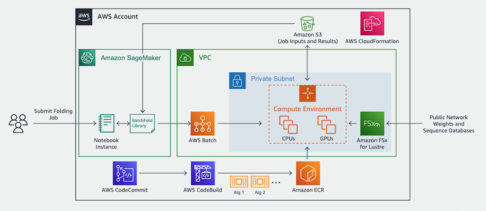
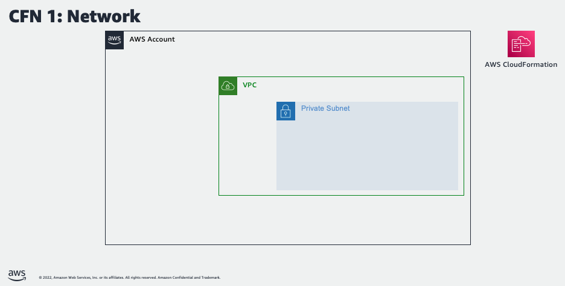
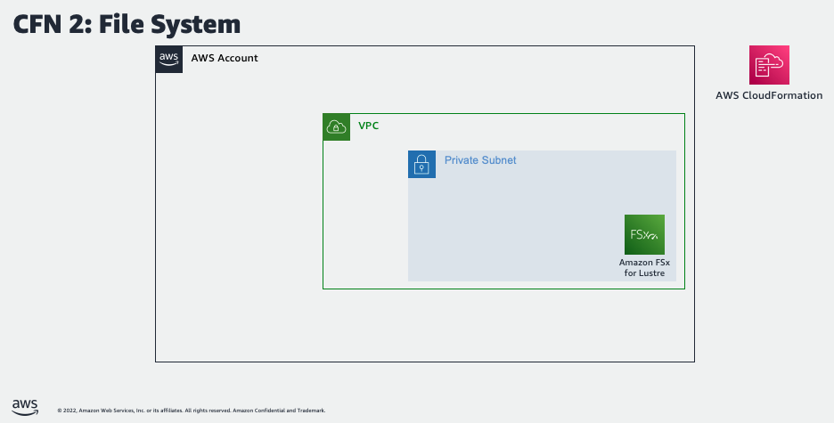
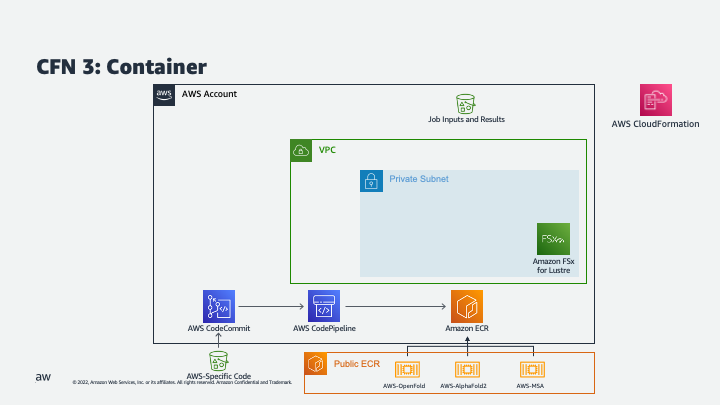
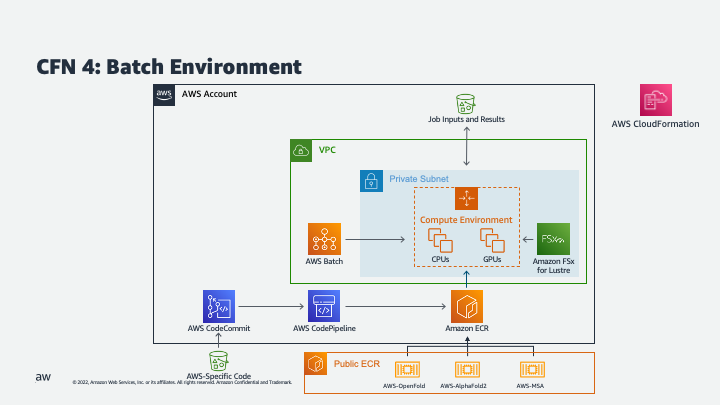
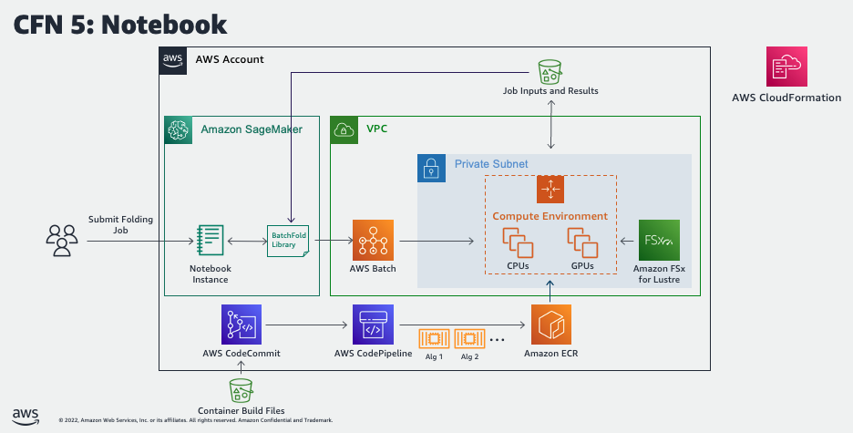

# AWS Batch Architecture for Protein Folding and Design
-----
## Overview
Proteins are large biomolecules that play an important role in the body. Knowing the physical structure of proteins is key to understanding their function. However, it can be difficult and expensive to determine the structure of many proteins experimentally. One alternative is to predict these structures using machine learning algorithms. Several high-profile research teams have released such algorithms, including [OpenFold](https://github.com/aqlaboratory/openfold), [AlphaFold 2](https://deepmind.com/blog/article/alphafold-a-solution-to-a-50-year-old-grand-challenge-in-biology), [RoseTTAFold](https://www.ipd.uw.edu/2021/07/rosettafold-accurate-protein-structure-prediction-accessible-to-all/) ]and others. Their work was important enough for Science magazine to name it the ["2021 Breakthrough of the Year"](https://www.science.org/content/article/breakthrough-2021).

Many AI-driven folding algorithms use a multi-track transformer architecture trained on known protein templates to predict the structure of unknown peptide sequences. These predictions are heavily GPU-dependent and take anywhere from minutes to days to complete. The input features for these predictions include multiple sequence alignment (MSA) data. MSA algorithms are CPU-dependent and can themselves require several hours of processing time.

Running both the MSA and structure prediction steps in the same computing environment can be cost inefficient, because the expensive GPU resources required for the prediction sit unused while the MSA step runs. Instead, using a high-performance computing (HPC) service like [AWS Batch](https://aws.amazon.com/batch/) allows us to run each step as a containerized job with the best fit of CPU, memory, and GPU resources.

This repository includes the CloudFormation template, Jupyter Notebook, and supporting code to run protein folding algorithms on AWS Batch. This includes:

- Jackhmmer for MSA generation
- AlphaFold2, AlphaFold-Multimer, and OpenFold for protein structure prediction

-----
## Architecture Diagram


-----
## First time setup
### Deploy the infrastructure stack

1. Choose **Launch Stack**:

    [](https://console.aws.amazon.com/cloudformation/home#/stacks/create/review?templateURL=https://aws-batch-architecture-for-alphafold-public-artifacts.s3.amazonaws.com/main/batch-protein-folding-cfn-packaged.yaml)

2. Specify the following required parameters:
  - For **Stack Name**, enter a value unique to your account and region.
  - For **StackAvailabilityZone** choose an availability zone.
3. Provide a name for your stack, leave the other parameters as their default, and select **Next**.
4. Select **I acknowledge that AWS CloudFormation might create IAM resources with custom names**.
5. Choose **Create stack**.
6. Wait 15 minutes for AWS CloudFormation to create the infrastructure stack and AWS CodeBuild to build and publish the AWS-AlphaFold container to Amazon Elastic Container Registry (Amazon ECR).
7. Once the stack is active, AWS Batch will begin downloading the necessary reference data to the Amazon FSx for Lustre file system. This process will take about 8 hours to finish. 

### Launch SageMaker Notebook
(If **LaunchSageMakerNotebook** set to Y)
1. Navigate to [SageMaker](https://console.aws.amazon.com/sagemaker)
2. Select **Notebook** > **Notebook instances**.
3. Select the **Batch-Protein-Folding-Notebook** instance and then **Actions** > **Open Jupyter** or **Open JupyterLab**.

### Clone Notebook Repository
(If **LaunchSageMakerNotebook** set to N)
1. Navigate to [CodeCommit](https://console.aws.amazon.com/codesuite/codecommit).
2. Select the aws-alphafold repository that was just created and copy the clone URL.
3. Use the URL to clone the repository into your Jupyter notebook environment of choice, such as SageMaker Studio.

### Populate FSx for Lustre File System
1. If you set the **DownloadFsxData** parameter to **Y**, CloudFormation will automatically start a series of Batch jobs to populate the FSx for Lustre instance with a number of common sequence databases. If you set this parameter to **N** you will instead need to manually populate the file system. Once the CloudFormation stack is in a CREATE_COMPLETE status, you can begin populating the FSx for Lustre file system with the necessary sequence databases. To do this automatically, open a terminal in your notebooks environment and run the following commands from the **batch-protein-folding** directory:

```
> pip install .
> python prep_databases.py
```

2. It will take up to 8 hours to populate the file system, depending on your region. You can track its progress by navigating to the file system in the FSx for Lustre console.

### Cleaning Up
1. To delete all provisioned resources from from your account, navigate to [Cloud Formation](https://console.aws.amazon.com/cloudformation), select your stack, and then **Delete**. 

-----
## Optional Template Parameters
  - Select "Y" for **LaunchSageMakerNotebook** if you want to launch a managed sagemaker notebook instance to quickly run the provided Jupyter notebook.
  - Provide values for the **VPC**, **Subnet**, and **DefaultSecurityGroup** parameters to use existing network resources. If one or more of those parameters are left empty, CloudFormation will create a new VPC and FSx for Lustre instance for the stack.
  - Provide values for the **FileSystemId** and **FileSystemMountName** parameters to use an existing FSx for Lustre file system. If one or more of these parameters are left empty, CloudFormation will create a new file system for the stack.
  - Select "Y" for **DownloadFsxData** to automatically populate the FSx for Lustre file system with common sequence databases.

-----
## Usage
Use the provided `quick-start-openfold.ipynb` notebook to submit sequences for analysis and download the results.

-----
## Infrastructure Details
This architecture uses a nested CloudFormation template to create various resources in a particular sequence.

### Step 1: Provision Network Resources


(Optional) If existing resources are not provided as template parameters, create a VPC, subnets, NAT gateway, elastic IP, routes, and S3 endpoint.

### Step 2: Provision File System


(Optional) If existing resources are not provided as template parameters, create a FSx for Lustre file system.

### Step 3: Build Container Images


Download several container images from a public ECR repository and push them to a new, private repository in your account. Also download a .zip file with the example notebooks and other code into a CodeCommit repository.

### Step 4: Provision AWS Batch Environment


Create the launch template, compute environments, job queues, and job definitions needed to submit jobs to AWS Batch.

### Step 5: Download Reference Data


(Optional) If requested via a template parameter, create and run a Amazon Lambda-backed custom resource to download several open source proteomic data sets to the FSx Lustre instance.

-----
## Security

See [CONTRIBUTING](CONTRIBUTING.md#security-issue-notifications) for more information.

-----
## License

This project is licensed under the Apache-2.0 License.

-----
## Additional Information

### OpenFold Repository
Please visit https://github.com/aqlaboratory/openfold for more information about the OpenFold algorithm.

### Citations

The OpenFold citation is
```
@software{Ahdritz_OpenFold_2021,
  author = {Ahdritz, Gustaf and Bouatta, Nazim and Kadyan, Sachin and Xia, Qinghui and Gerecke, William and AlQuraishi, Mohammed},
  doi = {10.5281/zenodo.5709539},
  month = {11},
  title = {{OpenFold}},
  url = {https://github.com/aqlaboratory/openfold},
  year = {2021}
}
```

The original AlphaFold 2 paper is
```
@Article{AlphaFold2021,
  author  = {Jumper, John and Evans, Richard and Pritzel, Alexander and Green, Tim and Figurnov, Michael and Ronneberger, Olaf and Tunyasuvunakool, Kathryn and Bates, Russ and {\v{Z}}{\'\i}dek, Augustin and Potapenko, Anna and Bridgland, Alex and Meyer, Clemens and Kohl, Simon A A and Ballard, Andrew J and Cowie, Andrew and Romera-Paredes, Bernardino and Nikolov, Stanislav and Jain, Rishub and Adler, Jonas and Back, Trevor and Petersen, Stig and Reiman, David and Clancy, Ellen and Zielinski, Michal and Steinegger, Martin and Pacholska, Michalina and Berghammer, Tamas and Bodenstein, Sebastian and Silver, David and Vinyals, Oriol and Senior, Andrew W and Kavukcuoglu, Koray and Kohli, Pushmeet and Hassabis, Demis},
  journal = {Nature},
  title   = {Highly accurate protein structure prediction with {AlphaFold}},
  year    = {2021},
  volume  = {596},
  number  = {7873},
  pages   = {583--589},
  doi     = {10.1038/s41586-021-03819-2}
}
```
The AlphaFold-Multimer paper is 
```
@article {AlphaFold-Multimer2021,
  author       = {Evans, Richard and O{\textquoteright}Neill, Michael and Pritzel, Alexander and Antropova, Natasha and Senior, Andrew and Green, Tim and {\v{Z}}{\'\i}dek, Augustin and Bates, Russ and Blackwell, Sam and Yim, Jason and Ronneberger, Olaf and Bodenstein, Sebastian and Zielinski, Michal and Bridgland, Alex and Potapenko, Anna and Cowie, Andrew and Tunyasuvunakool, Kathryn and Jain, Rishub and Clancy, Ellen and Kohli, Pushmeet and Jumper, John and Hassabis, Demis},
  journal      = {bioRxiv}
  title        = {Protein complex prediction with AlphaFold-Multimer},
  year         = {2021},
  elocation-id = {2021.10.04.463034},
  doi          = {10.1101/2021.10.04.463034},
  URL          = {https://www.biorxiv.org/content/early/2021/10/04/2021.10.04.463034},
  eprint       = {https://www.biorxiv.org/content/early/2021/10/04/2021.10.04.463034.full.pdf},
}
```
OpenFold may be cited as 
```
@software{Ahdritz_OpenFold_2021,
  author = {Ahdritz, Gustaf and Bouatta, Nazim and Kadyan, Sachin and Xia, Qinghui and Gerecke, William and AlQuraishi, Mohammed},
  doi = {10.5281/zenodo.5709539},
  month = {11},
  title = {{OpenFold}},
  url = {https://github.com/aqlaboratory/openfold},
  year = {2021}
}
```